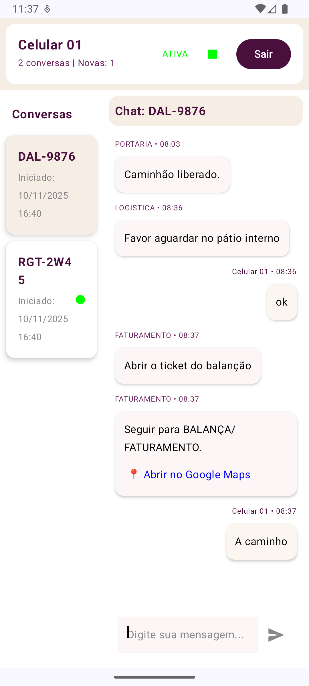
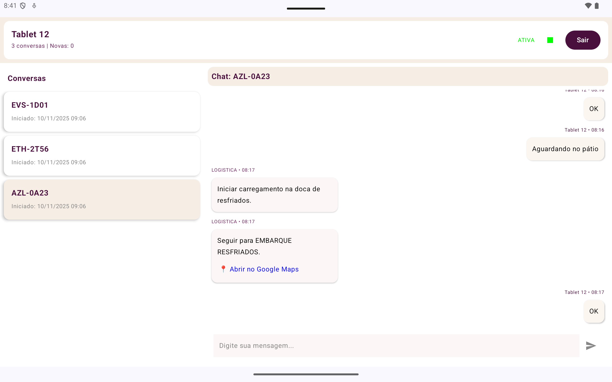
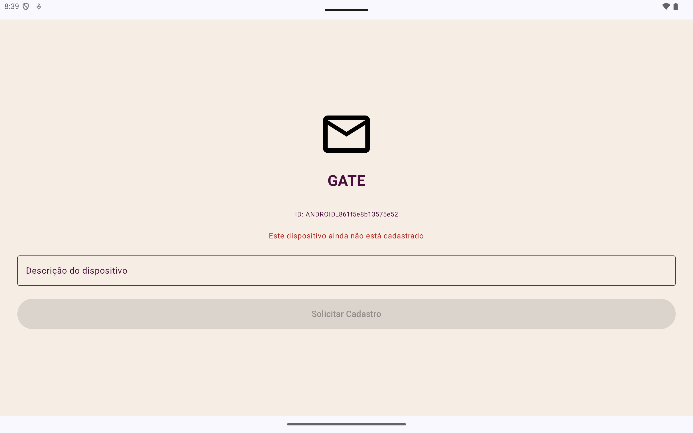
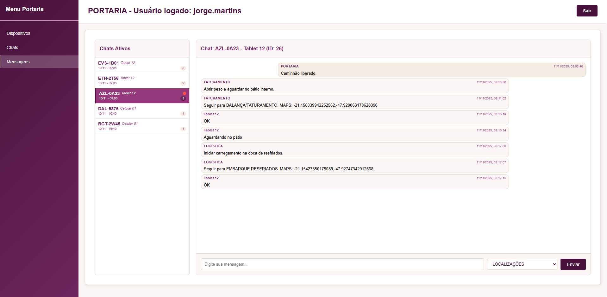
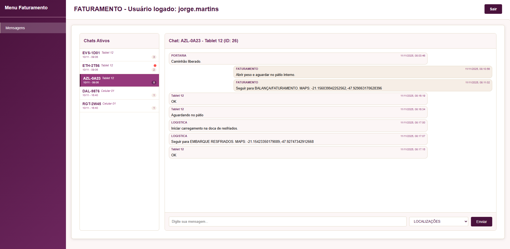
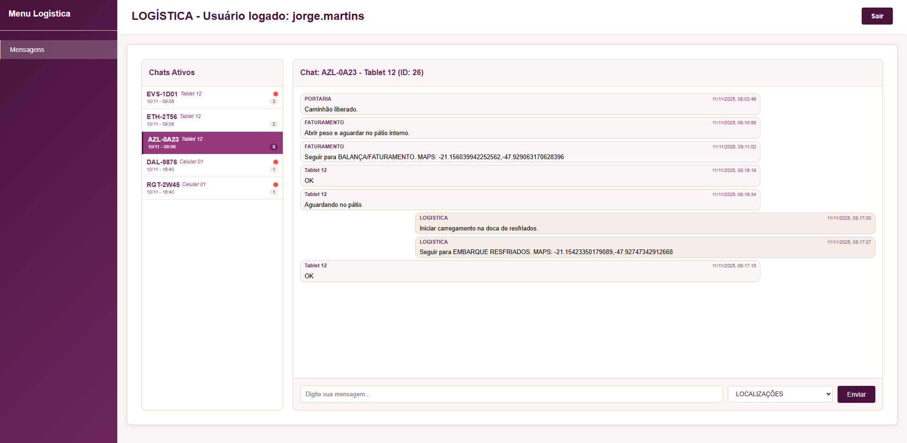

## Gate - Mensagens

Troca de mensagens entre setores da empresa com motoristas internos da empresa,  para ajudar no deslocamento entre docas e setores.

## 💬 Comunicação

O sistema realiza a **troca de mensagens em tempo real** entre os **setores internos da empresa** e os **motoristas** através de um **aplicativo Android**.  
As mensagens são sincronizadas com o backend desenvolvido em **Spring Boot**, e o front-end (painel web) em **HTMX**, permitindo controle total sobre as conversas, status e histórico de comunicação.

### 📸 Exemplos de telas

Abaixo alguns exemplos visuais disponíveis na pasta `IMAGE/` do repositório:

| Tela Celular | Tela Tablet | Tela Dispositivo Não Cadastro |
|-----------|---------------|------------------|
|  |  |  |

| Tela Portaria | Tela Faturamento | Tela Logistica |
|-----------|---------------|------------------|
|  |  |  |

## 🚀 Tecnologias Utilizadas

<table align="center">
  <tr>
    <th>Backend</th>
    <th>Front-end</th>
    <th>Android</th>
  </tr>
  <tr>
    <td align="center">
       
      <b>Spring Boot</b>
    </td>
    <td align="center">
       
      <b>HTMX</b>
    </td>
    <td align="center">
       
      <b>Android Studio</b>
    </td>
  </tr>
</table>
